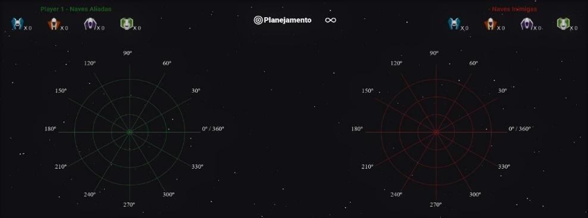
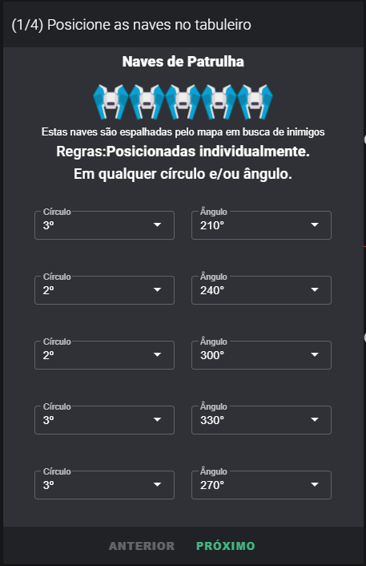
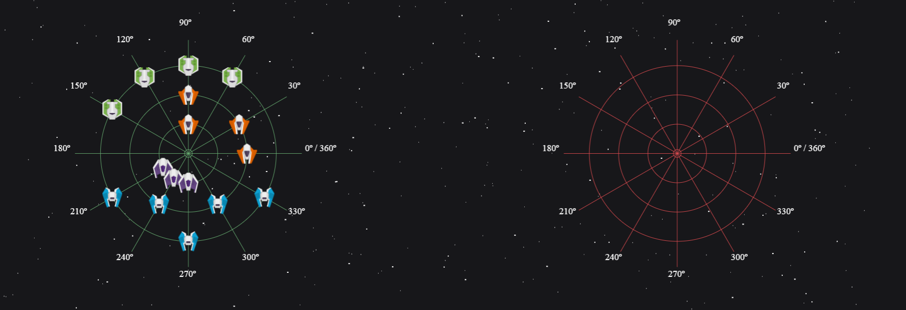
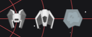

# Batalho dos Ângulos

**Batalha dos Ângulos** é a prototipação de um jogo educativo sobre ângulos, criado durante a elaboração de um **TCC** para a instituição de ensino **ESUCRI - Escola Superior de Criciúma**.

Feito por:
[Anderson](https://github.com/andersonmdn) e
[Talles](https://github.com/talgamom)

## Tecnologias Utilizadas

- [Vue.js](https://github.com/vuejs/vue)
- [Vuetify](https://github.com/vuetifyjs/vuetify)
- [Konva](https://github.com/konvajs/konva)
- [Socket.io](https://github.com/socketio/socket.io)
- [PostgreSQL](https://www.postgresql.org/)

## Campo de Batalha



## Caixa de Comando



## Mapa dos **Aliados** e dos **Inimigos**



## Mecanismo de Ataque


## Alvos Atingidos



## Mecânica de Jogo

.png>)

## Regras e Posicionamento

| Imagem                                          | Nave               | Quantidade | Descrição                                                                                                                                     | Grupo                                |
| ----------------------------------------------- | ------------------ | ---------- | --------------------------------------------------------------------------------------------------------------------------------------------- | ------------------------------------ |
|  | **Patrulha**       | 5          | Posicionadas individualmente. Em qualquer círculo e/ou ângulo.                                                                                | Não                                  |
|  | **Reconhecimento** | 4          | Posicionadas sempre em duplas de acordo com os seguintes critérios:Mesmo círculo ocupando ângulos vizinhosouMesmo ângulo em círculos vizinhos | Sim. Dois grupos com duas naves cada |
|  | **Multifunção**    | 3          | Posicionadas sempre em trios, de acordo com os seguintes critérios:Em ângulos vizinhos ou Em círculos vizinhos                                | Sim. Um grupo com três naves         |
|  | **Combate**        | 4          | Posicionadas todas no mesmo círculo com diferenças de 30º em cada posição.                                                                    | Sim. Um grupo com quatro naves       |

# Commands

```
serve -s C:\Projetos\BattleClass\client\dist

C:\ngrok\ngrok.exe http -config "C:\ngrok\ngrok.yml" 8080

C:\ngrok\ngrok.exe http -config "C:\ngrok\ngrok.yml" 3001

C:\ngrok\ngrok.exe http -config "C:\ngrok\ngrok.yml" 3000
```

```
C:\ngrok\ngrok.exe http -config "C:\ngrok\ngrok.yml" 5000
```

## Project setup

```
yarn install
```

### Compiles and hot-reloads for development

```
yarn run dev
```

### Compiles and minifies for production

```
yarn run build
```

### Lints and fixes files

```
yarn lint
```
